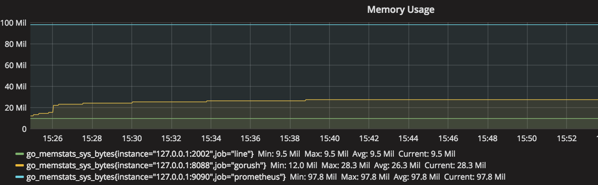
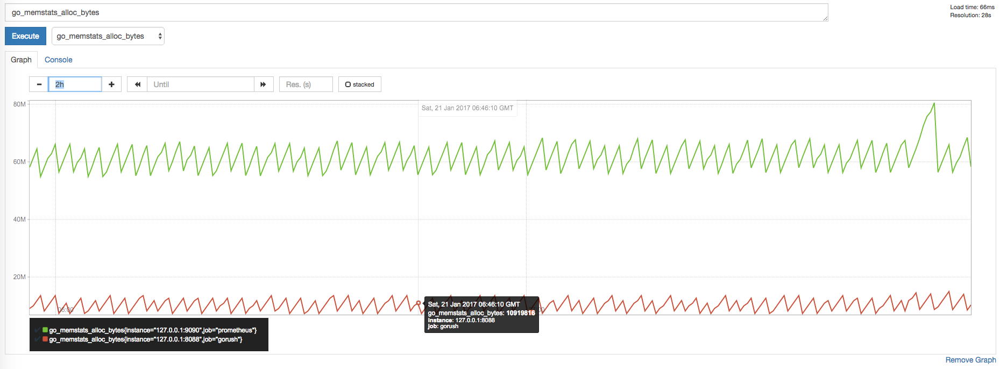
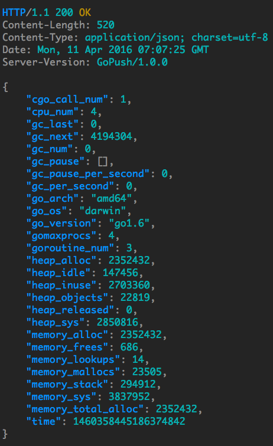
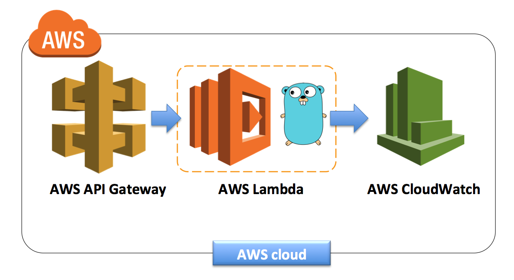

# gorush

A push notification micro server using [Gin](https://github.com/gin-gonic/gin) framework written in Go (Golang) and see the [demo app](https://github.com/appleboy/flutter-gorush).

[](https://github.com/appleboy/gorush/actions/workflows/testing.yml)
[](https://pkg.go.dev/github.com/appleboy/gorush)
[](https://codecov.io/gh/appleboy/gorush)
[](https://goreportcard.com/report/github.com/appleboy/gorush)
[](https://codebeat.co/projects/github-com-appleboy-gorush)
[](https://hub.docker.com/r/appleboy/gorush/)
[](https://app.netlify.com/sites/gorush/deploys)
[](https://opencollective.com/gorush)

## Contents

- [gorush](#gorush)
  - [Contents](#contents)
  - [Support Platform](#support-platform)
  - [Features](#features)
  - [Memory Usage](#memory-usage)
  - [Basic Usage](#basic-usage)
    - [Install from homebrew](#install-from-homebrew)
    - [Download a binary](#download-a-binary)
    - [Install from source](#install-from-source)
      - [Prerequisite Tools](#prerequisite-tools)
      - [Fetch from GitHub](#fetch-from-github)
    - [Command Usage](#command-usage)
    - [Send Android notification](#send-android-notification)
    - [Send Huawei (HMS) notification](#send-huawei-hms-notification)
    - [Send iOS notification](#send-ios-notification)
    - [Send Android or iOS notifications using Firebase Cloud Messaging](#send-android-or-ios-notifications-using-firebase-cloud-messaging)
  - [Run gorush web server](#run-gorush-web-server)
  - [Web API](#web-api)
    - [GET /api/stat/go](#get-apistatgo)
    - [GET /api/stat/app](#get-apistatapp)
    - [GET /sys/stats](#get-sysstats)
    - [GET /metrics](#get-metrics)
    - [POST /api/push](#post-apipush)
    - [Request body](#request-body)
    - [iOS alert payload](#ios-alert-payload)
    - [iOS sound payload](#ios-sound-payload)
    - [Android notification payload](#android-notification-payload)
    - [Huawei notification](#huawei-notification)
    - [iOS Example](#ios-example)
    - [Android Example](#android-example)
    - [Huawei Example](#huawei-example)
    - [Response body](#response-body)
  - [Run gRPC service](#run-grpc-service)
  - [Run gorush in Docker](#run-gorush-in-docker)
  - [Run gorush in Kubernetes](#run-gorush-in-kubernetes)
    - [Quick Start](#quick-start)
    - [Create the Service Controller for AWS ELB](#create-the-service-controller-for-aws-elb)
    - [Ingress Controller for AWS ALB](#ingress-controller-for-aws-alb)
    - [Clean up the gorush](#clean-up-the-gorush)
  - [Run gorush in AWS Lambda](#run-gorush-in-aws-lambda)
    - [Build gorush binary](#build-gorush-binary)
    - [Deploy gorush application](#deploy-gorush-application)
    - [Without an AWS account](#without-an-aws-account)
  - [Stargazers over time](#stargazers-over-time)
  - [License](#license)

## Support Platform

- [APNS](https://developer.apple.com/documentation/usernotifications)
- [FCM](https://firebase.google.com/)
- [HMS](https://developer.huawei.com/consumer/en/hms/)

[A live server on Netlify](https://gorush.netlify.app/) and get notification token on [Firebase Cloud Messaging web](https://fcm-demo-88b40.web.app/). You can use the token to send a notification to the device.

```bash
curl -X POST \
     -H "Content-Type: application/json" \
     -d '{
  "notifications": [
    {
      "tokens": [
        "your_device_token"
      ],
      "platform": 2,
      "title": "Test Title",
      "message": "Test Message"
    }
  ]
}' \
  https://gorush.netlify.app/api/push
```

## Features

- Support [Firebase Cloud Messaging](https://firebase.google.com/docs/cloud-messaging) using [go-fcm](https://github.com/appleboy/go-fcm) library for Android.
- Support [HTTP/2](https://http2.github.io/) Apple Push Notification Service using [apns2](https://github.com/sideshow/apns2) library.
- Support [HMS Push Service](https://developer.huawei.com/consumer/en/hms/huawei-pushkit) using [go-hms-push](https://github.com/msalihkarakasli/go-hms-push) library for Huawei Devices.
- Support [YAML](https://github.com/go-yaml/yaml) configuration.
- Support command line to send single Android or iOS notification.
- Support Web API to send push notification.
- Support [HTTP/2](https://http2.github.io/) or HTTP/1.1 protocol.
- Support notification queue and multiple workers.
- Support `/api/stat/app` show notification success and failure counts.
- Support `/api/config` show your [YAML](https://en.wikipedia.org/wiki/YAML) config.
- Support store app stat to memory, [Redis](http://redis.io/), [BoltDB](https://github.com/boltdb/bolt), [BuntDB](https://github.com/tidwall/buntdb), [LevelDB](https://github.com/syndtr/goleveldb) or [BadgerDB](https://github.com/dgraph-io/badger).
- Support `p8`, `p12` or `pem` format of iOS certificate file.
- Support `/sys/stats` show response time, status code count, etc.
- Support for HTTP, HTTPS or SOCKS5 proxy.
- Support retry send notification if server response is fail.
- Support expose [prometheus](https://prometheus.io/) metrics.
- Support install TLS certificates from [Let's Encrypt](https://letsencrypt.org/) automatically.
- Support send notification through [RPC](https://en.wikipedia.org/wiki/Remote_procedure_call) protocol, we use [gRPC](https://grpc.io/) as default framework.
- Support running in Docker, [Kubernetes](https://kubernetes.io/) or [AWS Lambda](https://aws.amazon.com/lambda) ([Native Support in Golang](https://aws.amazon.com/blogs/compute/announcing-go-support-for-aws-lambda/))
- Support graceful shutdown that workers and queue have been sent to APNs/FCM before shutdown service.
- Support different Queue as backend like [NSQ](https://nsq.io/), [NATS](https://nats.io/) or [Redis streams](https://redis.io/docs/manual/data-types/streams/), defaut engine is local [Channel](https://tour.golang.org/concurrency/2).

See the default [YAML config example](config/testdata/config.yml):

```yaml
core:
  enabled: true # enable httpd server
  address: "" # ip address to bind (default: any)
  shutdown_timeout: 30 # default is 30 second
  port: "8088" # ignore this port number if auto_tls is enabled (listen 443).
  worker_num: 0 # default worker number is runtime.NumCPU()
  queue_num: 0 # default queue number is 8192
  max_notification: 100
  # set true if you need get error message from fail push notification in API response.
  # It only works when the queue engine is local.
  sync: false
  # set webhook url if you need get error message asynchronously from fail push notification in API response.
  feedback_hook_url: ""
  feedback_timeout: 10 # default is 10 second
  feedback_header:
  mode: "release"
  ssl: false
  cert_path: "cert.pem"
  key_path: "key.pem"
  cert_base64: ""
  key_base64: ""
  http_proxy: ""
  pid:
    enabled: false
    path: "gorush.pid"
    override: true
  auto_tls:
    enabled: false # Automatically install TLS certificates from Let's Encrypt.
    folder: ".cache" # folder for storing TLS certificates
    host: "" # which domains the Let's Encrypt will attempt

grpc:
  enabled: false # enable gRPC server
  port: 9000

api:
  push_uri: "/api/push"
  stat_go_uri: "/api/stat/go"
  stat_app_uri: "/api/stat/app"
  config_uri: "/api/config"
  sys_stat_uri: "/sys/stats"
  metric_uri: "/metrics"
  health_uri: "/healthz"

android:
  enabled: true
  key_path: "" # path to fcm key file
  credential: "" # fcm credential data
  max_retry: 0 # resend fail notification, default value zero is disabled

huawei:
  enabled: false
  appsecret: "YOUR_APP_SECRET"
  appid: "YOUR_APP_ID"
  max_retry: 0 # resend fail notification, default value zero is disabled

queue:
  engine: "local" # support "local", "nsq", "nats" and "redis" default value is "local"
  nsq:
    addr: 127.0.0.1:4150
    topic: gorush
    channel: gorush
  nats:
    addr: 127.0.0.1:4222
    subj: gorush
    queue: gorush
  redis:
    addr: 127.0.0.1:6379
    group: gorush
    consumer: gorush
    stream_name: gorush
  redis:
    addr: 127.0.0.1:6379
    group: gorush
    consumer: gorush
    stream_name: gorush
    with_tls: false
    username: ""
    password: ""

ios:
  enabled: false
  key_path: ""
  key_base64: "" # load iOS key from base64 input
  key_type: "pem" # could be pem, p12 or p8 type
  password: "" # certificate password, default as empty string.
  production: false
  max_concurrent_pushes: 100 # just for push ios notification
  max_retry: 0 # resend fail notification, default value zero is disabled
  key_id: "" # KeyID from developer account (Certificates, Identifiers & Profiles -> Keys)
  team_id: "" # TeamID from developer account (View Account -> Membership)

log:
  format: "string" # string or json
  access_log: "stdout" # stdout: output to console, or define log path like "log/access_log"
  access_level: "debug"
  error_log: "stderr" # stderr: output to console, or define log path like "log/error_log"
  error_level: "error"
  hide_token: true
  hide_messages: false

stat:
  engine: "memory" # support memory, redis, boltdb, buntdb or leveldb
  redis:
    cluster: false
    addr: "localhost:6379" # if cluster is true, you may set this to "localhost:6379,localhost:6380,localhost:6381"
    username: ""
    password: ""
    db: 0
  boltdb:
    path: "bolt.db"
    bucket: "gorush"
  buntdb:
    path: "bunt.db"
  leveldb:
    path: "level.db"
  badgerdb:
    path: "badger.db"
```

## Memory Usage

Memory average usage: **28Mb** (the total bytes of memory obtained from the OS.)



Test Command (We use [bat](https://github.com/astaxie/bat) as default cli tool.):

```sh
for i in {1..9999999}; do bat -b.N=1000 -b.C=100 POST localhost:8088/api/push notifications:=@notification.json; sleep 1;  done
```

## Basic Usage

How to send push notification using `gorush` command? (Android or iOS)

### Install from homebrew

```sh
brew tap appleboy/tap
brew install gorush
```

### Download a binary

The pre-compiled binaries can be downloaded from [release page](https://github.com/appleboy/gorush/releases).

With `Go` installed

```sh
go install github.com/appleboy/gorush
```

On linux

```sh
wget https://github.com/appleboy/gorush/releases/download/v1.18.9/gorush-1.18.9-linux-amd64 -O gorush
```

On macOS (Intel amd64)

```sh
wget -c https://github.com/appleboy/gorush/releases/download/v1.18.9/gorush-1.18.9-darwin-amd64 -O gorush
```

On macOS (Apple arm64)

```sh
wget -c https://github.com/appleboy/gorush/releases/download/v1.18.9/gorush-1.18.9-darwin-arm64 -O gorush
```

### Install from source

#### Prerequisite Tools

- [Git](http://git-scm.com/)
- [Go (at least Go 1.22)](https://go.dev/dl/)

#### Fetch from GitHub

Gorush uses the Go Modules support built into Go 1.11 to build. The easiest way to get started is to clone Gorush in a directory outside of the GOPATH, as in the following example:

```sh
mkdir $HOME/src
cd $HOME/src
git clone https://github.com/appleboy/gorush.git
cd gorush
go install
```

or you can use the `go get` command to install the latest or specific version.

**Note**: such go get installation aren't guaranteed to work. We recommend using binary installation.

```sh
# install stable version
go install github.com/appleboy/gorush

# install latest version
go install github.com/appleboy/gorush@master
```

### Command Usage

```sh
  ________                              .__
 /  _____/   ____ _______  __ __  ______|  |__
/   \  ___  /  _ \\_  __ \|  |  \/  ___/|  |  \
\    \_\  \(  <_> )|  | \/|  |  /\___ \ |   Y  \
 \______  / \____/ |__|   |____//____  >|___|  /
        \/                           \/      \/

Usage: gorush [options]

Server Options:
    -A, --address <address>          Address to bind (default: any)
    -p, --port <port>                Use port for clients (default: 8088)
    -c, --config <file>              Configuration file path
    -m, --message <message>          Notification message
    -t, --token <token>              Notification token
    -e, --engine <engine>            Storage engine (memory, redis ...)
    --title <title>                  Notification title
    --proxy <proxy>                  Proxy URL
    --pid <pid path>                 Process identifier path
    --redis-addr <redis addr>        Redis addr (default: localhost:6379)
    --ping                           healthy check command for container
iOS Options:
    -i, --key <file>                 certificate key file path
    -P, --password <password>        certificate key password
    --ios                            enabled iOS (default: false)
    --production                     iOS production mode (default: false)
Android Options:
    --fcm-key <fcm_key_path>         FCM Key Path
    --android                        enabled android (default: false)
Huawei Options:
    -hk, --hmskey <hms_key>          HMS App Secret
    -hid, --hmsid <hms_id>           HMS App ID
    --huawei                         enabled huawei (default: false)
Common Options:
    --topic <topic>                  iOS, Android or Huawei topic message
    -h, --help                       Show this message
    -V, --version                    Show version
```

### Send Android notification

To authenticate a service account and authorize it to access Firebase services, you must generate a private key file in JSON format.

1. In the Firebase console, open **Settings** > [Service Accounts](https://console.firebase.google.com/project/_/settings/serviceaccounts/adminsdk?_gl=1*1eqxjfp*_ga*MTQ0NjI5MTQ2MS4xNzA4NjA3MzU0*_ga_CW55HF8NVT*MTcxNzgxNDMyNi4xMS4xLjE3MTc4MTUyMzguNjAuMC4w).
2. Click **Generate New Private Key**, then confirm by clicking **Generate Key**.
3. Securely store the JSON file containing the key.

When authorizing via a service account, you have two choices for providing the credentials to your application. You can either set the **GOOGLE_APPLICATION_CREDENTIALS** environment variable, or you can explicitly pass the path to the service account key in code. The first option is more secure and is strongly recommended.

Send single notification with the following command.

```bash
gorush -android -m "your message" --fcm-key "FCM Credentials Key Path" -t "device token"

# or set GOOGLE_APPLICATION_CREDENTIALS environment variable
export GOOGLE_APPLICATION_CREDENTIALS="FCM Credentials Key Path"
gorush -android -m "your message" -t "device token"
```

Send messages to topics.

```bash
gorush --android --topic "foo-bar" \
  -m "This is a Firebase Cloud Messaging Topic Message" \
  --fcm-key "FCM Credentials Key Path"
```

- `-m`: Notification message.
- `--fcm-key`: [Firebase Cloud Messaging Provide credentials manually](https://firebase.google.com/docs/cloud-messaging/auth-server#provide-credentials-manually)
- `-t`: Device token.
- `--title`: Notification title.
- `--topic`: Send messages to topics. note: don't add device token.
- `--proxy`: Set `http`, `https` or `socks5` proxy url.

### Send Huawei (HMS) notification

Send single notification with the following command.

```bash
gorush -huawei -title "Gorush with HMS" -m "your message" -hk "API Key" -hid "App ID" -t "Device token"
```

Send messages to topics.

```bash
gorush --huawei --topic "foo-bar" \
  -title "Gorush with HMS" \
  -m "This is a Huawei Mobile Services Topic Message" \
  -hk "API Key" \
  -hid "App ID"
```

- `-m`: Notification message.
- `-hk`: [Huawei Mobile Services](https://developer.huawei.com/consumer/en/doc/development/HMS-Guides/Preparations) api secret key
- `-t`: Device token.
- `--title`: Notification title.
- `--topic`: Send messages to topics. note: don't add device token.
- `--proxy`: Set `http`, `https` or `socks5` proxy url.

### Send iOS notification

Send single notification with the following command.

```bash
$ gorush -ios -m "your message" -i "your certificate path" \
  -t "device token" --topic "apns topic"
```

- `-m`: Notification message.
- `-i`: Apple Push Notification Certificate path (`pem` or `p12` file).
- `-t`: Device token.
- `--title`: Notification title.
- `--topic`: The topic of the remote notification.
- `--password`: The certificate password.

The default endpoint is APNs development. Please add `-production` flag for APNs production push endpoint.

```bash
$ gorush -ios -m "your message" -i "your certificate path" \
  -t "device token" \
  -production
```

### Send Android or iOS notifications using Firebase Cloud Messaging

Send single notification with the following command:

```bash
gorush -android -m "your message" \
  --fcm-key "FCM Credentials Key Path" \
  -t "Device token"
```

## Run gorush web server

Please make sure your [config.yml](config/testdata/config.yml) exist. Default port is `8088`.

```bash
# for default config
$ gorush
# for custom config file
$ gorush -c config.yml
```

Get go status of api server using [httpie](https://github.com/httpie/cli) tool:

```bash
# install httpie
brew install httpie
# get go status
http -v --json GET http://localhost:8088/api/stat/go
```

## Web API

Gorush support the following API.

- **GET** `/api/stat/go` Golang cpu, memory, gc, etc information. Thanks for [golang-stats-api-handler](https://github.com/fukata/golang-stats-api-handler).
- **GET** `/api/stat/app` show notification success and failure counts.
- **GET** `/api/config` show server yml config file.
- **POST** `/api/push` push ios, android or huawei notifications.

### GET /api/stat/go

Golang cpu, memory, gc, etc information. Response with `200` http status code.

```json
{
  "time": 1460686815848046600,
  "go_version": "go1.6.1",
  "go_os": "darwin",
  "go_arch": "amd64",
  "cpu_num": 4,
  "goroutine_num": 15,
  "gomaxprocs": 4,
  "cgo_call_num": 1,
  "memory_alloc": 7455192,
  "memory_total_alloc": 8935464,
  "memory_sys": 12560632,
  "memory_lookups": 17,
  "memory_mallocs": 31426,
  "memory_frees": 11772,
  "memory_stack": 524288,
  "heap_alloc": 7455192,
  "heap_sys": 8912896,
  "heap_idle": 909312,
  "heap_inuse": 8003584,
  "heap_released": 0,
  "heap_objects": 19654,
  "gc_next": 9754725,
  "gc_last": 1460686815762559700,
  "gc_num": 2,
  "gc_per_second": 0,
  "gc_pause_per_second": 0,
  "gc_pause": [0.326576, 0.227096]
}
```

### GET /api/stat/app

Show success or failure counts information of notification.

```json
{
  "version": "v1.6.2",
  "busy_workers": 0,
  "success_tasks": 32,
  "failure_tasks": 49,
  "submitted_tasks": 81,
  "total_count": 81,
  "ios": {
    "push_success": 19,
    "push_error": 38
  },
  "android": {
    "push_success": 10,
    "push_error": 10
  },
  "huawei": {
    "push_success": 3,
    "push_error": 1
  }
}
```

### GET /sys/stats

Show response time, status code count, etc.

```json
{
  "pid": 80332,
  "uptime": "1m42.428010614s",
  "uptime_sec": 102.428010614,
  "time": "2016-06-26 12:27:11.675973571 +0800 CST",
  "unixtime": 1466915231,
  "status_code_count": {},
  "total_status_code_count": {
    "200": 5
  },
  "count": 0,
  "total_count": 5,
  "total_response_time": "10.422441ms",
  "total_response_time_sec": 0.010422441000000001,
  "average_response_time": "2.084488ms",
  "average_response_time_sec": 0.0020844880000000002
}
```

### GET /metrics

Support expose [prometheus](https://prometheus.io/) metrics.



### POST /api/push

Simple send iOS notification example, the `platform` value is `1`:

```json
{
  "notifications": [
    {
      "tokens": ["token_a", "token_b"],
      "platform": 1,
      "message": "Hello World iOS!"
    }
  ]
}
```

Simple send Android notification example, the `platform` value is `2`:

```json
{
  "notifications": [
    {
      "tokens": ["token_a", "token_b"],
      "platform": 2,
      "message": "Hello World Android!"
    }
  ]
}
```

Simple send Huawei notification example, the `platform` value is `3`:

```json
{
  "notifications": [
    {
      "tokens": ["token_a", "token_b"],
      "platform": 3,
      "title": "Gorush with HMS",
      "message": "Hello World Huawei!"
    }
  ]
}
```

Simple send notification on Android and iOS devices using Firebase, the `platform` value is `2`:

```json
{
  "notifications": [
    {
      "tokens": ["token_a", "token_b"],
      "platform": 2,
      "message": "This notification will go to iOS and Android platform via Firebase!"
    }
  ]
}
```

Send notification with custom sound on iOS devices, **volume must be in the interval [0, 1]**:

```json
{
  "notifications": [
    {
      "tokens": ["token_a", "token_b"],
      "title": "Hello World iOS!",
      "message": "Hello World iOS!",
      "platform": 2,
      "apns": {
        "payload": {
          "aps": {
            "sound": {
              "name": "default",
              "critical": 1,
              "volume": 0.1
            }
          }
        }
      }
    }
  ]
}
```

Send multiple notifications as below:

```json
{
  "notifications": [
    {
      "tokens": ["token_a", "token_b"],
      "platform": 1,
      "message": "Hello World iOS!"
    },
    {
      "tokens": ["token_a", "token_b"],
      "platform": 2,
      "message": "Hello World Android!"
    },
    {
      "tokens": ["token_a", "token_b"],
      "platform": 3,
      "message": "Hello World Huawei!",
      "title": "Gorush with HMS"
    },
    .....
  ]
}
```

See more example about [iOS](#ios-example), [Android](#android-example) or [Huawei](#huawei-example)

### Request body

The Request body must have a notifications array. The following is a parameter table for each notification.

| name                    | type         | description                                                                                       | required | note                                                          |
| ----------------------- | ------------ | ------------------------------------------------------------------------------------------------- | -------- | ------------------------------------------------------------- |
| notif_id                | string       | A unique string that identifies the notification for async feedback                               | -        |                                                               |
| tokens                  | string array | device tokens                                                                                     | o        |                                                               |
| platform                | int          | platform(iOS,Android)                                                                             | o        | 1=iOS, 2=Android (Firebase), 3=Huawei (HMS)                   |
| message                 | string       | message for notification                                                                          | -        |                                                               |
| title                   | string       | notification title                                                                                | -        |                                                               |
| priority                | string       | Sets the priority of the message.                                                                 | -        | `normal` or `high`                                            |
| content_available       | bool         | data messages wake the app by default.                                                            | -        |                                                               |
| sound                   | interface{}  | sound type                                                                                        | -        |                                                               |
| data                    | string array | extensible partition                                                                              | -        | only Android and IOS                                          |
| huawei_data             | string       | JSON object as string to extensible partition partition                                           | -        | only Huawei. See the [detail](#huawei-notification)           |
| retry                   | int          | retry send notification if fail response from server. Value must be small than `max_retry` field. | -        |                                                               |
| topic                   | string       | send messages to topics                                                                           |          |                                                               |
| image                   | string       | image url to show in notification                                                                 | -        | only Android and Huawei                                       |
| to                      | string       | The value must be a registration token, notification key, or topic.                               | -        | only Android                                                  |
| collapse_key            | string       | a key for collapsing notifications                                                                | -        | only Android                                                  |
| huawei_collapse_key     | int          | a key integer for collapsing notifications                                                        | -        | only Huawei See the [detail](#huawei-notification)            |
| delay_while_idle        | bool         | a flag for device idling                                                                          | -        | only Android                                                  |
| time_to_live            | uint         | expiration of message kept on FCM storage                                                         | -        | only Android                                                  |
| huawei_ttl              | string       | expiration of message kept on HMS storage                                                         | -        | only Huawei See the [detail](#huawei-notification)            |
| restricted_package_name | string       | the package name of the application                                                               | -        | only Android                                                  |
| dry_run                 | bool         | allows developers to test a request without actually sending a message                            | -        | only Android                                                  |
| notification            | string array | payload of a FCM message                                                                          | -        | only Android. See the [detail](#android-notification-payload) |
| huawei_notification     | string array | payload of a HMS message                                                                          | -        | only Huawei. See the [detail](#huawei-notification)           |
| app_id                  | string       | hms app id                                                                                        | -        | only Huawei. See the [detail](#huawei-notification)           |
| bi_tag                  | string       | Tag of a message in a batch delivery task                                                         | -        | only Huawei. See the [detail](#huawei-notification)           |
| fast_app_target         | int          | State of a mini program when a quick app sends a data message.                                    | -        | only Huawei. See the [detail](#huawei-notification)           |
| expiration              | int          | expiration for notification                                                                       | -        | only iOS                                                      |
| apns_id                 | string       | A canonical UUID that identifies the notification                                                 | -        | only iOS                                                      |
| collapse_id             | string       | An identifier you use to coalesce multiple notifications into a single notification for the user  | -        | only iOS                                                      |
| push_type               | string       | The type of the notification. The value of this header is alert or background.                    | -        | only iOS                                                      |
| badge                   | int          | badge count                                                                                       | -        | only iOS                                                      |
| category                | string       | the UIMutableUserNotificationCategory object                                                      | -        | only iOS                                                      |
| alert                   | string array | payload of a iOS message                                                                          | -        | only iOS. See the [detail](#ios-alert-payload)                |
| mutable_content         | bool         | enable Notification Service app extension.                                                        | -        | only iOS(10.0+).                                              |
| name                    | string       | sets the name value on the aps sound dictionary.                                                  | -        | only iOS                                                      |
| volume                  | float32      | sets the volume value on the aps sound dictionary.                                                | -        | only iOS                                                      |
| interruption_level      | string       | defines the interruption level for the push notification.                                         | -        | only iOS(15.0+)                                               |
| content-state           | string array | dynamic and custom content for live-activity notification.                                        | -        | only iOS(16.1+)                                               |
| timestamp               | int          | the UNIX time when sending the remote notification that updates or ends a Live Activity           | -        | only iOS(16.1+)                                               |
| event                   | string       | describes whether you update or end an ongoing Live Activity                                      | -        | only iOS(16.1+)                                               |
| stale-date              | int          | the date which a Live Activity becomes stale, or out of date                                      | -        | only iOS(16.1+)                                               |
| dismissal-date          | int          | the UNIX time -timestamp- which a Live Activity will end and will be removed                      | -        | only iOS(16.1+)                                               |

### iOS alert payload

| name           | type             | description                                                                                      | required | note |
| -------------- | ---------------- | ------------------------------------------------------------------------------------------------ | -------- | ---- |
| title          | string           | Apple Watch & Safari display this string as part of the notification interface.                  | -        |      |
| body           | string           | The text of the alert message.                                                                   | -        |      |
| subtitle       | string           | Apple Watch & Safari display this string as part of the notification interface.                  | -        |      |
| action         | string           | The label of the action button. This one is required for Safari Push Notifications.              | -        |      |
| action-loc-key | string           | If a string is specified, the system displays an alert that includes the Close and View buttons. | -        |      |
| launch-image   | string           | The filename of an image file in the app bundle, with or without the filename extension.         | -        |      |
| loc-args       | array of strings | Variable string values to appear in place of the format specifiers in loc-key.                   | -        |      |
| loc-key        | string           | A key to an alert-message string in a Localizable.strings file for the current localization.     | -        |      |
| title-loc-args | array of strings | Variable string values to appear in place of the format specifiers in title-loc-key.             | -        |      |
| title-loc-key  | string           | The key to a title string in the Localizable.strings file for the current localization.          | -        |      |

See more detail about [APNs Remote Notification Payload](https://developer.apple.com/library/content/documentation/NetworkingInternet/Conceptual/RemoteNotificationsPG/PayloadKeyReference.html).

### iOS sound payload

| name     | type    | description                                          | required | note |
| -------- | ------- | ---------------------------------------------------- | -------- | ---- |
| name     | string  | sets the name value on the aps sound dictionary.     | -        |      |
| volume   | float32 | sets the volume value on the aps sound dictionary.   | -        |      |
| critical | int     | sets the critical value on the aps sound dictionary. | -        |      |

request format:

```json
{
  "sound": {
    "critical": 1,
    "name": "default",
    "volume": 2.0
  }
}
```

### Android notification payload

| name           | type   | description                                                                                               | required | note |
| -------------- | ------ | --------------------------------------------------------------------------------------------------------- | -------- | ---- |
| icon           | string | Indicates notification icon.                                                                              | -        |      |
| tag            | string | Indicates whether each notification message results in a new entry on the notification center on Android. | -        |      |
| color          | string | Indicates color of the icon, expressed in #rrggbb format                                                  | -        |      |
| click_action   | string | The action associated with a user click on the notification.                                              | -        |      |
| body_loc_key   | string | Indicates the key to the body string for localization.                                                    | -        |      |
| body_loc_args  | string | Indicates the string value to replace format specifiers in body string for localization.                  | -        |      |
| title_loc_key  | string | Indicates the key to the title string for localization.                                                   | -        |      |
| title_loc_args | string | Indicates the string value to replace format specifiers in title string for localization.                 | -        |      |

See more detail about [Firebase Cloud Messaging HTTP Protocol reference](https://firebase.google.com/docs/cloud-messaging/http-server-ref#send-downstream).

### Huawei notification

1. app_id: app id from huawei developer console
2. bi_tag:
3. fast_app_target:
4. huawei_data: mapped to data
5. huawei_notification: mapped to notification
6. huawei_ttl: mapped to ttl
7. huawei_collapse_key: mapped to collapse_key

See more detail about [Huawei Mobulse Services Push API reference](https://developer.huawei.com/consumer/en/doc/development/HMS-References/push-sendapi).

### iOS Example

Send normal notification.

```json
{
  "notifications": [
    {
      "tokens": ["token_a", "token_b"],
      "platform": 1,
      "message": "Hello World iOS!"
    }
  ]
}
```

The following payload asks the system to display an alert with a Close button and a single action button.The title and body keys provide the contents of the alert. The “PLAY” string is used to retrieve a localized string from the appropriate Localizable.strings file of the app. The resulting string is used by the alert as the title of an action button. This payload also asks the system to badge the app’s icon with the number 5.

```json
{
  "notifications": [
    {
      "tokens": ["token_a", "token_b"],
      "platform": 1,
      "badge": 5,
      "alert": {
        "title": "Game Request",
        "body": "Bob wants to play poker",
        "action-loc-key": "PLAY"
      }
    }
  ]
}
```

The following payload specifies that the device should display an alert message, plays a sound, and badges the app’s icon.

```json
{
  "notifications": [
    {
      "tokens": ["token_a", "token_b"],
      "platform": 1,
      "message": "You got your emails.",
      "badge": 9,
      "sound": {
        "critical": 1,
        "name": "default",
        "volume": 1.0
      }
    }
  ]
}
```

Add other fields which user defined via `data` field.

```json
{
  "notifications": [
    {
      "tokens": ["token_a", "token_b"],
      "platform": 1,
      "message": "Hello World iOS!",
      "data": {
        "key1": "welcome",
        "key2": 2
      }
    }
  ]
}
```

Support send notification from different environment. See the detail of [issue](https://github.com/appleboy/gorush/issues/246).

```diff
{
  "notifications": [
    {
      "tokens": ["token_a", "token_b"],
      "platform": 1,
+     "production": true,
      "message": "Hello World iOS Production!"
    },
    {
      "tokens": ["token_a", "token_b"],
      "platform": 1,
+     "development": true,
      "message": "Hello World iOS Sandbox!"
    }
  ]
}
```

### Android Example

Send normal notification.

```json
{
  "notifications": [
    {
      "tokens": ["token_a", "token_b"],
      "platform": 2,
      "message": "Hello World Android!",
      "title": "You got message"
    }
  ]
}
```

Label associated with the message's analytics data.

```json
{
  "notifications": [
    {
      "tokens": ["token_a", "token_b"],
      "platform": 2,
      "message": "Hello World Android!",
      "title": "You got message",
      "fcm_options": {
        "analytics_label": "example"
      }
    }
  ]
}
```

Add `notification` payload.

```json
{
  "notifications": [
    {
      "tokens": ["token_a", "token_b"],
      "platform": 2,
      "message": "Hello World Android!",
      "title": "You got message",
      "notification": {
        "icon": "myicon",
        "color": "#112244"
      }
    }
  ]
}
```

Add other fields which user defined via `data` field.

```json
{
  "notifications": [
    {
      "tokens": ["token_a", "token_b"],
      "platform": 2,
      "message": "Hello World Android!",
      "title": "You got message",
      "data": {
        "Nick": "Mario",
        "body": "great match!",
        "Room": "PortugalVSDenmark"
      }
    }
  ]
}
```

Send messages to topic

```json
{
  "notifications": [
    {
      "topic": "highScores",
      "platform": 2,
      "message": "This is a Firebase Cloud Messaging Topic Message"
    }
  ]
}
```

### Huawei Example

Send normal notification.

```json
{
  "notifications": [
    {
      "tokens": ["token_a", "token_b"],
      "platform": 3,
      "message": "Hello World Huawei!",
      "title": "You got message"
    }
  ]
}
```

Add `notification` payload.

```json
{
  "notifications": [
    {
      "tokens": ["token_a", "token_b"],
      "platform": 3,
      "message": "Hello World Huawei!",
      "title": "You got message",
      "huawei_notification": {
        "icon": "myicon",
        "color": "#112244"
      }
    }
  ]
}
```

Add other fields which user defined via `huawei_data` field.

```json
{
  "notifications": [
    {
      "tokens": ["token_a", "token_b"],
      "platform": 3,
      "huawei_data": "{'title' : 'Mario','message' : 'great match!', 'Room' : 'PortugalVSDenmark'}"
    }
  ]
}
```

Send messages to topics

```json
{
  "notifications": [
    {
      "topic": "foo-bar",
      "platform": 3,
      "message": "This is a Huawei Mobile Services Topic Message",
      "title": "You got message"
    }
  ]
}
```

### Response body

Error response message table:

| status code | message                                    |
| ----------- | ------------------------------------------ |
| 400         | Missing `notifications` field.             |
| 400         | Notifications field is empty.              |
| 400         | Number of notifications(50) over limit(10) |

Success response:

```json
{
  "counts": 60,
  "logs": [],
  "success": "ok"
}
```

If you need error logs from sending fail notifications, please set a `feedback_hook_url` and `feedback_header` for custom header. The server with send the failing logs asynchronously to your API as `POST` requests.

```diff
core:
  port: "8088" # ignore this port number if auto_tls is enabled (listen 443).
  worker_num: 0 # default worker number is runtime.NumCPU()
  queue_num: 0 # default queue number is 8192
  max_notification: 100
  sync: false
- feedback_hook_url: ""
+ feedback_hook_url: "https://exemple.com/api/hook"
+ feedback_header:
+   - x-gorush-token:4e989115e09680f44a645519fed6a976
```

You can also switch to **sync** mode by setting the `sync` value as `true` on yaml config. It only works when the queue engine is local.

```diff
core:
  port: "8088" # ignore this port number if auto_tls is enabled (listen 443).
  worker_num: 0 # default worker number is runtime.NumCPU()
  queue_num: 0 # default queue number is 8192
  max_notification: 100
- sync: false
+ sync: true
```

See the following error format.

```json
{
  "counts": 60,
  "logs": [
    {
      "type": "failed-push",
      "platform": "android",
      "token": "*******",
      "message": "Hello World Android!",
      "error": "InvalidRegistration"
    },
    {
      "type": "failed-push",
      "platform": "ios",
      "token": "*****",
      "message": "Hello World iOS1111!",
      "error": "Post https://api.push.apple.com/3/device/bbbbb: remote error: tls: revoked certificate"
    },
    {
      "type": "failed-push",
      "platform": "ios",
      "token": "*******",
      "message": "Hello World iOS222!",
      "error": "Post https://api.push.apple.com/3/device/token_b: remote error: tls: revoked certificate"
    }
  ],
  "success": "ok"
}
```

## Run gRPC service

Gorush support [gRPC](https://grpc.io/) service. You can enable the gRPC in `config.yml`, default as disabled. Enable the gRPC server:

```sh
GORUSH_GRPC_ENABLED=true GORUSH_GRPC_PORT=3000 gorush
```

The following example code to send single notification in Go.

```go
package main

import (
  "context"
  "log"

  "github.com/appleboy/gorush/rpc/proto"

  structpb "github.com/golang/protobuf/ptypes/struct"
  "google.golang.org/grpc"
)

const (
  address = "localhost:9000"
)

func main() {
  // Set up a connection to the server.
  conn, err := grpc.NewClient(address, grpc.WithInsecure())
  if err != nil {
    log.Fatalf("did not connect: %v", err)
  }
  defer conn.Close()
  c := proto.NewGorushClient(conn)

  r, err := c.Send(context.Background(), &proto.NotificationRequest{
    Platform: 2,
    Tokens:   []string{"1234567890"},
    Message:  "test message",
    Badge:    1,
    Category: "test",
    Sound:    "test",
    Priority: proto.NotificationRequest_HIGH,
    Alert: &proto.Alert{
      Title:    "Test Title",
      Body:     "Test Alert Body",
      Subtitle: "Test Alert Sub Title",
      LocKey:   "Test loc key",
      LocArgs:  []string{"test", "test"},
    },
    Data: &structpb.Struct{
      Fields: map[string]*structpb.Value{
        "key1": {
          Kind: &structpb.Value_StringValue{StringValue: "welcome"},
        },
        "key2": {
          Kind: &structpb.Value_NumberValue{NumberValue: 2},
        },
      },
    },
  })
  if err != nil {
    log.Println("could not greet: ", err)
  }

  if r != nil {
    log.Printf("Success: %t\n", r.Success)
    log.Printf("Count: %d\n", r.Counts)
  }
}
```

See the Node.js example and see more detail from [README](rpc/example/node/README.md):

```js
var messages = require("./gorush_pb");
var services = require("./gorush_grpc_pb");

var grpc = require("grpc");

function main() {
  var client = new services.GorushClient(
    "localhost:9000",
    grpc.credentials.createInsecure()
  );
  var request = new messages.NotificationRequest();
  var alert = new messages.Alert();
  request.setPlatform(2);
  request.setTokensList(["1234567890"]);
  request.setMessage("Hello!!");
  request.setTitle("hello2");
  request.setBadge(2);
  request.setCategory("mycategory");
  request.setSound("sound");
  alert.setTitle("title");
  request.setAlert(alert);
  request.setThreadid("threadID");
  request.setContentavailable(false);
  request.setMutablecontent(false);
  client.send(request, function (err, response) {
    if (err) {
      console.log(err);
    } else {
      console.log("Success:", response.getSuccess());
      console.log("Counts:", response.getCounts());
    }
  });
}

main();
```

GRPC Health Checking example: See [document](https://github.com/grpc/grpc/blob/master/doc/health-checking.md).

```go
package main

import (
  "context"
  "log"

  "github.com/appleboy/gorush/rpc/proto"

  structpb "github.com/golang/protobuf/ptypes/struct"
  "google.golang.org/grpc"
)

const (
  address = "localhost:9000"
)

func main() {
  // Set up a connection to the server.
  conn, err := grpc.NewClient(address, grpc.WithInsecure())
  if err != nil {
    log.Fatalf("did not connect: %v", err)
  }
  defer conn.Close()
  c := proto.NewGorushClient(conn)

  r, err := c.Send(context.Background(), &proto.NotificationRequest{
    Platform: 2,
    Tokens:   []string{"1234567890"},
    Message:  "test message",
    Badge:    1,
    Category: "test",
    Sound:    "test",
    Priority: proto.NotificationRequest_HIGH,
    Alert: &proto.Alert{
      Title:    "Test Title",
      Body:     "Test Alert Body",
      Subtitle: "Test Alert Sub Title",
      LocKey:   "Test loc key",
      LocArgs:  []string{"test", "test"},
    },
    Data: &structpb.Struct{
      Fields: map[string]*structpb.Value{
        "key1": {
          Kind: &structpb.Value_StringValue{StringValue: "welcome"},
        },
        "key2": {
          Kind: &structpb.Value_NumberValue{NumberValue: 2},
        },
      },
    },
  })
  if err != nil {
    log.Println("could not greet: ", err)
  }

  if r != nil {
    log.Printf("Success: %t\n", r.Success)
    log.Printf("Count: %d\n", r.Counts)
  }
}
```

## Run gorush in Docker

Set up `gorush` in the cloud in under 5 minutes with zero knowledge of Golang or Linux shell using our [gorush Docker image](https://hub.docker.com/r/appleboy/gorush/).

```bash
docker pull appleboy/gorush
docker run --name gorush -p 80:8088 appleboy/gorush
```

Run `gorush` with your own config file.

```bash
docker pull appleboy/gorush
docker run --name gorush -v ${PWD}/config.yml:/home/gorush/config.yml -p 80:8088 appleboy/gorush
```

Testing your gorush server using [httpie](https://github.com/jkbrzt/httpie) command.

```bash
http -v --verify=no --json GET http://your.docker.host/api/stat/go
```



## Run gorush in Kubernetes

### Quick Start

Create namespace as `gorush` as `gorush` and then your configuration map:

```sh
kubectl create -f k8s/gorush-namespace.yaml
kubectl create -f k8s/gorush-configmap.yaml
```

Create redis service:

```sh
kubectl create -f k8s/gorush-redis-deployment.yaml
kubectl create -f k8s/gorush-redis-service.yaml
```

Create gorush deployment controller provides declarative updates for Pods and ReplicaSets:

```sh
kubectl create -f k8s/gorush-deployment.yaml
```

### Create the Service Controller for AWS ELB

```sh
kubectl create -f k8s/gorush-service.yaml
```

### Ingress Controller for AWS ALB

Update the following in `k8s/gorush-service.yaml`

```diff
-  type: LoadBalancer
-  # type: NodePort
+  # type: LoadBalancer
+  type: NodePort
```

Then start the AWS ALB by the follwong command.

```sh
kubectl create -f k8s/gorush-service.yaml
kubectl create -f k8s/gorush-aws-alb-ingress.yaml
```

### Clean up the gorush

```sh
kubectl delete -f k8s
```

## Run gorush in AWS Lambda



AWS excited to [announce Go as a supported language for AWS Lambda](https://aws.amazon.com/blogs/compute/announcing-go-support-for-aws-lambda/). You’re going to create an application that uses an [API Gateway](https://aws.amazon.com/apigateway) event source to create a simple Hello World RESTful API.

### Build gorush binary

Download source code first.

```sh
git clone https://github.com/appleboy/gorush.git
cd gorush && make build_linux_lambda
```

you can see the binary file in `release/linux/lambda/` folder

### Deploy gorush application

we need to build a binary that will run on Linux, and ZIP it up into a deployment package.

```sh
zip deployment.zip release/linux/lambda/gorush
```

Upload the `deployment.zip` via web UI or you can try the [drone-lambda](https://github.com/appleboy/drone-lambda) as the following command. it will zip your binary file and upload to AWS Lambda automatically.

```sh
$ AWS_ACCESS_KEY_ID=YOUR_AWS_ACCESS_KEY_ID \
  AWS_SECRET_ACCESS_KEY=YOUR_AWS_SECRET_ACCESS_KEY \
  drone-lambda --region ap-southeast-1 \
  --function-name gorush \
  --source release/linux/lambda/gorush
```

### Without an AWS account

Or you can deploy gorush to alternative solution like [netlify functions](https://docs.netlify.com/functions/overview/). [Netlify](https://www.netlify.com/) lets you deploy serverless Lambda functions without an AWS account, and with function management handled directly within Netlify. Please see the netlify.toml file:

```toml
[build]
command = "make build_linux_lambda"
functions = "release/linux/lambda"

[build.environment]
GO111MODULE = "on"
GO_IMPORT_PATH = "github.com/appleboy/gorush"
GO_VERSION = "1.21.11"

[[redirects]]
from = "/*"
status = 200
to = "/.netlify/functions/gorush/:splat"
```

## Stargazers over time

[](https://starchart.cc/appleboy/gorush)

## License

Copyright 2019 Bo-Yi Wu [@appleboy](https://twitter.com/appleboy).

Licensed under the MIT License.
